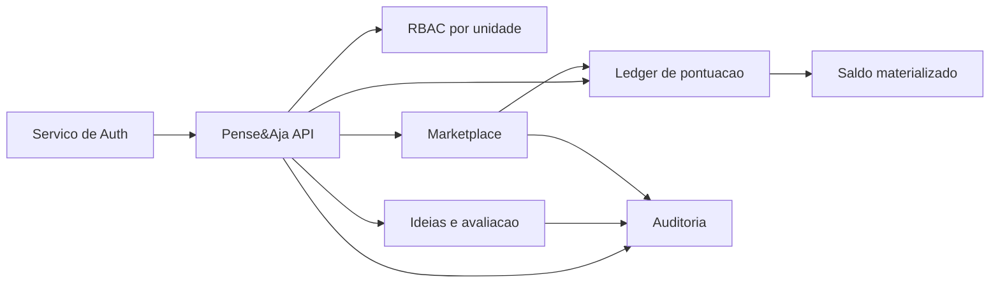
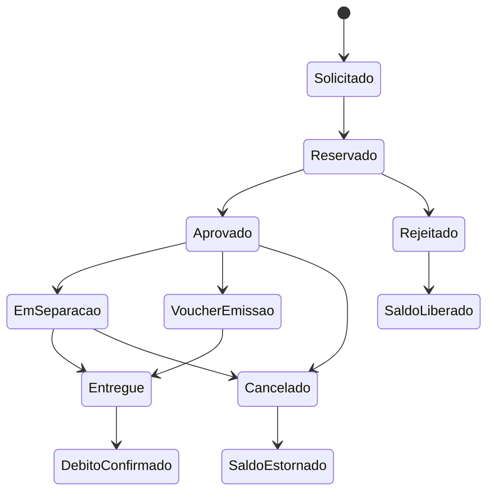

# Implementation Plan - Pense&Aja

## Objetivo

Este documento consolida o plano de evolução do Pense&Aja para um modelo mais seguro, auditável e escalável. Ele descreve o estado atual, os gaps identificados, a arquitetura-alvo e a ordem recomendada de implementação.

O princípio central da evolução é:

- backend como fonte de verdade
- autorização dinâmica por unidade
- trilha auditável para decisão, pontuação e resgate
- compatibilidade progressiva com os contratos atuais

## Gaps atuais confirmados

### Autorização

- o backend aceita acesso por substring em `funcao` (`analista`, `gerente`, `automacao`)
- o frontend replica essa heurística na UI
- não existe modelo formal de papel, permissão e escopo por unidade

### Pontuação

- `pense_aja_pontos` funciona como armazenamento mutável de saldo gerado por avaliação
- reprovação ou exclusão remove pontos, mas sem contralançamento imutável
- não existe livro-razão com origem, motivo, actor e correlação

### Auditoria

- não existe tabela específica de histórico de transição de status
- decisões de avaliação não mantêm diff explícito de campos relevantes
- rastreabilidade de "quem fez o quê e quando" é incompleta

### Marketplace e resgates

- o resgate atual acontece em um único passo
- não há reserva de saldo no momento da solicitação
- não há workflow operacional formal de aprovação, separação, entrega, cancelamento e estorno
- o modelo atual não diferencia item físico de voucher digital

## Arquitetura-alvo

### Pilares

1. Identidade vem do serviço externo de auth.
2. Autorização é resolvida localmente pelo backend do Pense&Aja.
3. Pontos são registrados em ledger append-only.
4. Saldo é derivado de projeção materializada do ledger.
5. Mudanças de status geram eventos auditáveis com ator, timestamp e diff.
6. Cada unidade Dass pode possuir configuração própria de workflow e pontuação.

### Domínios principais

- Ideias e avaliação
- RBAC por unidade
- Ledger de pontuação
- Marketplace e fulfillment
- Auditoria e histórico
- Configuração por unidade
- Notificações

## Modelo funcional-alvo

### RBAC dinâmico por unidade

- usuário pode ter papéis diferentes em unidades diferentes
- papéis deixam de ser inferidos por `funcao`
- permissões passam a ser granularizadas por ação
- sessão autenticada pode carregar um snapshot curto de permissões, mas a fonte de verdade continua no backend

### Ledger de pontuação

Tipos mínimos de lançamento:

- `earn`: ganho de pontos por avaliação válida
- `reverse`: reversão de ganho anterior
- `reserve`: bloqueio de saldo no pedido de resgate
- `commit`: consumo definitivo do saldo reservado
- `release`: liberação de saldo reservado
- `refund`: estorno após falha operacional ou cancelamento elegível

Regras:

- ledger é imutável
- saldo disponível não é salvo por update direto no mesmo registro
- toda operação deve ter referência de origem, unidade, ator, correlação e motivo

### Auditoria de domínio

Eventos auditáveis mínimos:

- cadastro de ideia
- transição de avaliação
- geração ou reversão de pontos
- solicitação de resgate
- aprovação, separação, entrega, cancelamento ou estorno
- mudança relevante de configuração por unidade

Cada evento deve incluir:

- tipo de evento
- entidade afetada
- `before` e `after` dos campos sensíveis
- ator
- unidade
- timestamp
- motivo/justificativa
- correlation id

### Marketplace automatizado

Fluxo-base:

1. colaborador solicita resgate
2. backend valida saldo e cria reserva
3. workflow operacional aprova ou rejeita a solicitação
4. item físico segue separação e entrega, ou voucher segue emissão
5. conclusão converte reserva em débito definitivo
6. falha ou cancelamento elegível gera liberação ou estorno

## Fases de execução

### Fase 1 - Sincronização documental

- atualizar `README.md`
- atualizar `specs/DESIGN_SPEC.md`
- reescrever `specs/backend/BUSINESS_RULES.md`
- atualizar `specs/backend/ROUTES.md`, `INTEGRATIONS.md` e `DATABASE_MODELS.md`
- alinhar `specs/frontend/BUSINESS_RULES.md` e `INTEGRATIONS.md`
- deixar explícita a diferença entre estado atual e modelo-alvo

### Fase 2 - Refatoração técnica backend-first

- introduzir modelo normalizado de RBAC por unidade
- substituir middleware de papel hardcoded por resolução dinâmica de permissões
- implantar ledger append-only com transações
- materializar saldo e histórico
- criar auditoria de eventos e transição de status
- modularizar avaliação, pontuação, resgate e marketplace em serviços independentes

### Fase 3 - Ajustes de frontend

- substituir inferência local de permissão por snapshot de sessão resolvido pelo backend
- adaptar telas de saldo, histórico e marketplace
- revisar status e UX para refletir workflow auditável

## Critérios de aceite da arquitetura-alvo

- nenhuma decisão sensível depende de substring em `funcao`
- toda mudança de status relevante gera evento auditável
- nenhuma remoção de pontos acontece sem contralançamento rastreável
- resgate não pode consumir saldo sem reserva prévia
- saldo disponível é consistente com o ledger
- unidade define políticas sem exigir fork de regra de negócio

## Assunções adotadas

- o serviço externo de auth continua responsável por login, cookie e refresh
- o backend do Pense&Aja resolve autorização por unidade
- a compatibilidade com os endpoints atuais deve ser preservada sempre que possível
- `specs/backend/BUSINESS_RULES.md` permanece como regra de negócio canônica do backend
