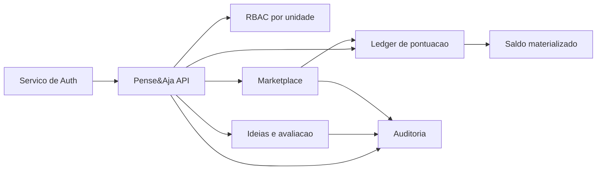
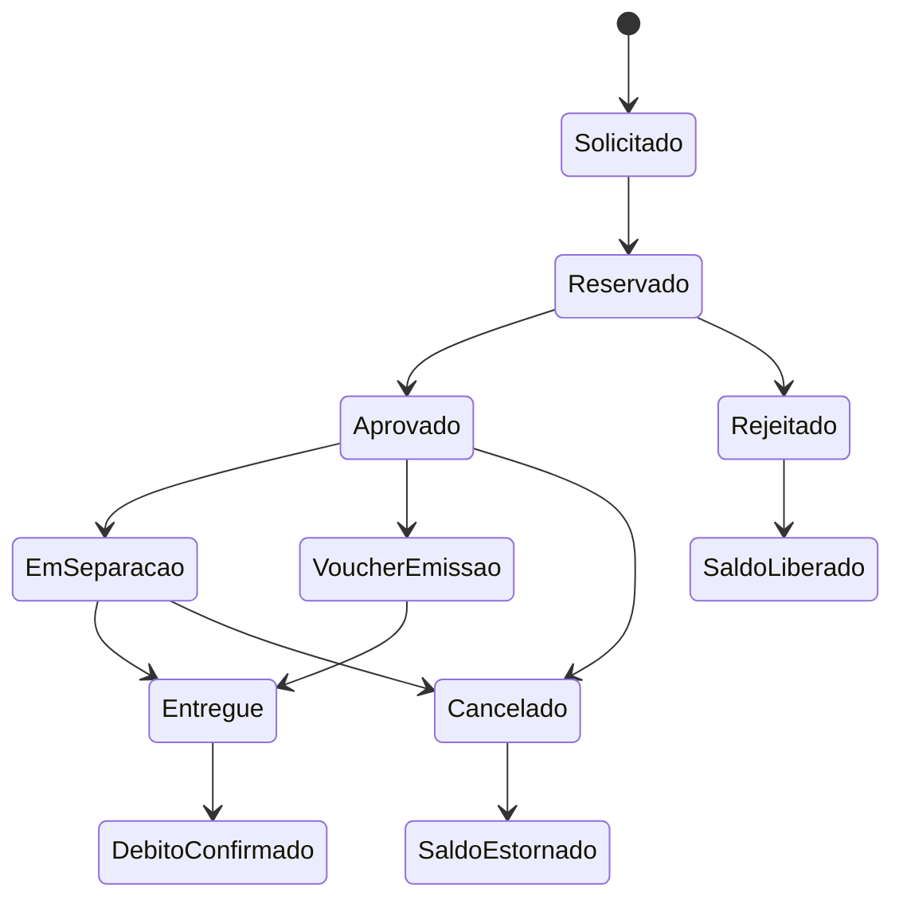

# Implementation Plan - Pense&Aja

## Objetivo

Este documento consolida o plano de evolução do Pense&Aja para um modelo mais seguro, auditável e escalável. Ele descreve o estado atual, os gaps identificados, a arquitetura-alvo e a ordem recomendada de implementação.

O princípio central da evolução é:

- backend como fonte de verdade
- autorização dinâmica por unidade
- trilha auditável para decisão, pontuação e resgate
- compatibilidade progressiva com os contratos atuais

## Gaps atuais confirmados

### Autorização

- o backend aceita acesso por substring em `funcao` (`analista`, `gerente`, `automacao`)
- o frontend replica essa heurística na UI
- não existe modelo formal de papel, permissão e escopo por unidade

### Pontuação

- `pense_aja_pontos` funciona como armazenamento mutável de saldo gerado por avaliação
- reprovação ou exclusão remove pontos, mas sem contralançamento imutável
- não existe livro-razão com origem, motivo, actor e correlação

### Auditoria

- não existe tabela específica de histórico de transição de status
- decisões de avaliação não mantêm diff explícito de campos relevantes
- rastreabilidade de "quem fez o quê e quando" é incompleta

### Marketplace e resgates

- o resgate atual acontece em um único passo
- não há reserva de saldo no momento da solicitação
- não há workflow operacional formal de aprovação, separação, entrega, cancelamento e estorno
- o modelo atual não diferencia item físico de voucher digital

## Arquitetura-alvo

### Pilares

1. Identidade vem do serviço externo de auth.
2. Autorização é resolvida localmente pelo backend do Pense&Aja.
3. Pontos são registrados em ledger append-only.
4. Saldo é derivado de projeção materializada do ledger.
5. Mudanças de status geram eventos auditáveis com ator, timestamp e diff.
6. Cada unidade Dass pode possuir configuração própria de workflow e pontuação.

### Domínios principais

- Ideias e avaliação
- RBAC por unidade
- Ledger de pontuação
- Marketplace e fulfillment
- Auditoria e histórico
- Configuração por unidade
- Notificações



## Modelo funcional-alvo

### RBAC dinâmico por unidade

- usuário pode ter papéis diferentes em unidades diferentes
- papéis deixam de ser inferidos por `funcao`
- permissões passam a ser granularizadas por ação
- sessão autenticada pode carregar um snapshot curto de permissões, mas a fonte de verdade continua no backend

### Ledger de pontuação

Tipos mínimos de lançamento:

- `earn`: ganho de pontos por avaliação válida
- `reverse`: reversão de ganho anterior
- `reserve`: bloqueio de saldo no pedido de resgate
- `commit`: consumo definitivo do saldo reservado
- `release`: liberação de saldo reservado
- `refund`: estorno após falha operacional ou cancelamento elegível

Regras:

- ledger é imutável
- saldo disponível não é salvo por update direto no mesmo registro
- toda operação deve ter referência de origem, unidade, ator, correlação e motivo

### Auditoria de domínio

Eventos auditáveis mínimos:

- cadastro de ideia
- transição de avaliação
- geração ou reversão de pontos
- solicitação de resgate
- aprovação, separação, entrega, cancelamento ou estorno
- mudança relevante de configuração por unidade

Cada evento deve incluir:

- tipo de evento
- entidade afetada
- `before` e `after` dos campos sensíveis
- ator
- unidade
- timestamp
- motivo/justificativa
- correlation id

### Marketplace automatizado

Fluxo-base:

1. colaborador solicita resgate
2. backend valida saldo e cria reserva
3. workflow operacional aprova ou rejeita a solicitação
4. item físico segue separação e entrega, ou voucher segue emissão
5. conclusão converte reserva em débito definitivo
6. falha ou cancelamento elegível gera liberação ou estorno



## Fases de execução

### Fase 1 - Sincronização documental

- atualizar `README.md`
- atualizar `specs/DESIGN_SPEC.md`
- reescrever `specs/backend/BUSINESS_RULES.md`
- atualizar `specs/backend/ROUTES.md`, `INTEGRATIONS.md` e `DATABASE_MODELS.md`
- alinhar `specs/frontend/BUSINESS_RULES.md` e `INTEGRATIONS.md`
- deixar explícita a diferença entre estado atual e modelo-alvo

### Fase 2 - Refatoração técnica backend-first

- introduzir modelo normalizado de RBAC por unidade
- substituir middleware de papel hardcoded por resolução dinâmica de permissões
- implantar ledger append-only com transações
- materializar saldo e histórico
- criar auditoria de eventos e transição de status
- modularizar avaliação, pontuação, resgate e marketplace em serviços independentes

### Fase 3 - Ajustes de frontend

- substituir inferência local de permissão por snapshot de sessão resolvido pelo backend
- adaptar telas de saldo, histórico e marketplace
- revisar status e UX para refletir workflow auditável

## Status de conclusão

### Legenda

- `concluído`
- `parcial`
- `pendente`

### Fase 1 - Sincronização documental

- status: `concluído`
- entregue:
  - `README.md` atualizado
  - `specs/DESIGN_SPEC.md` atualizado
  - `specs/backend/BUSINESS_RULES.md` reescrito
  - `specs/backend/ROUTES.md`, `INTEGRATIONS.md` e `DATABASE_MODELS.md` alinhados
  - `specs/frontend/BUSINESS_RULES.md` e `INTEGRATIONS.md` alinhados
  - `IMPLEMENTATION_PLAN.md` criado na raiz

### Fase 2 - Refatoração técnica backend-first

- status: `parcial`
- concluído:
  - infraestrutura inicial de migrations TypeORM
  - modelos de RBAC, ledger, auditoria e resgate legado
  - middleware de permissão por unidade
  - dual-write inicial em avaliação e resgate legado
  - projeção de saldo
  - script de bootstrap inicial para `admin_master`
  - script de backfill para ledger
  - CRUD RBAC para administração manual por `admin_master`
  - endpoints mínimos de contexto de sessão, histórico de pontos e trilha de auditoria
  - testes unitários iniciais
- pendente:
  - executar `migrate:run` em ambiente real
  - executar `backfill:ledger` em ambiente real
  - validar relatório de migração e divergências por unidade
  - adicionar testes de integração com banco real
  - migrar leituras restantes para `points_balance_projection`
  - completar workflow novo de marketplace
  - remover dependência final do fluxo legado como fonte primária

### Fase 3 - Ajustes de frontend

- status: `pendente`
- pendente:
  - consumir `session-context` no frontend
  - remover inferência de permissão por `funcao`
  - adaptar perfil para saldo consolidado e histórico de ledger
  - adaptar loja e resgate ao workflow novo
  - revisar status e avaliação para workflow por unidade
  - alinhar dashboard às leituras consolidadas do backend

## Próximas etapas recomendadas

1. rodar migrations e backfills em ambiente controlado
2. validar totais migrados por unidade e por usuário
3. adicionar testes de integração backend com PostgreSQL
4. migrar leituras de saldo e dashboard para projeções novas
5. iniciar a segunda etapa do marketplace e, depois, a adaptação do frontend

## Queries de verificação pós-migração

Estas queries devem ser usadas após `migrate:run`, `bootstrap:admin-master` e `backfill:ledger` para reduzir risco de perda de dados ou inconsistência de saldo.

### 1. Contagem de linhas legadas versus linhas migradas

```sql
SELECT COUNT(*) AS legacy_points_count
FROM pense_aja.pense_aja_pontos;

SELECT COUNT(*) AS ledger_legacy_points_count
FROM pense_aja.points_ledger_entries
WHERE source_type = 'legacy_points';

SELECT COUNT(*) AS legacy_rewards_count
FROM pense_aja.pense_aja_premios;

SELECT COUNT(*) AS ledger_legacy_rewards_count
FROM pense_aja.points_ledger_entries
WHERE source_type = 'legacy_reward';
```

### 2. Verificação consolidada por unidade com divergência automática

```sql
WITH legacy_points AS (
  SELECT
    unidade_dass,
    COUNT(*) AS legacy_points_rows,
    COALESCE(SUM(valor), 0) AS legacy_points_total
  FROM pense_aja.pense_aja_pontos
  GROUP BY unidade_dass
),
ledger_points AS (
  SELECT
    unidade_dass,
    COUNT(*) AS ledger_points_rows,
    COALESCE(SUM(amount), 0) AS ledger_points_total
  FROM pense_aja.points_ledger_entries
  WHERE source_type = 'legacy_points'
    AND entry_type = 'earn'
  GROUP BY unidade_dass
),
legacy_rewards AS (
  SELECT
    unidade_dass,
    COUNT(*) AS legacy_reward_rows,
    COALESCE(SUM(pontos_premio_solicitado), 0) AS legacy_reward_total
  FROM pense_aja.pense_aja_premios
  GROUP BY unidade_dass
),
ledger_rewards AS (
  SELECT
    unidade_dass,
    COUNT(*) AS ledger_reward_rows,
    COALESCE(SUM(amount), 0) AS ledger_reward_total
  FROM pense_aja.points_ledger_entries
  WHERE source_type = 'legacy_reward'
    AND entry_type = 'commit'
  GROUP BY unidade_dass
),
units AS (
  SELECT unidade_dass FROM legacy_points
  UNION
  SELECT unidade_dass FROM ledger_points
  UNION
  SELECT unidade_dass FROM legacy_rewards
  UNION
  SELECT unidade_dass FROM ledger_rewards
)
SELECT
  units.unidade_dass,
  COALESCE(lp.legacy_points_rows, 0) AS legacy_points_rows,
  COALESCE(lgp.ledger_points_rows, 0) AS ledger_points_rows,
  COALESCE(lp.legacy_points_total, 0) AS legacy_points_total,
  COALESCE(lgp.ledger_points_total, 0) AS ledger_points_total,
  COALESCE(lr.legacy_reward_rows, 0) AS legacy_reward_rows,
  COALESCE(lgr.ledger_reward_rows, 0) AS ledger_reward_rows,
  COALESCE(lr.legacy_reward_total, 0) AS legacy_reward_total,
  COALESCE(lgr.ledger_reward_total, 0) AS ledger_reward_total,
  COALESCE(lgp.ledger_points_total, 0) - COALESCE(lp.legacy_points_total, 0) AS points_delta,
  COALESCE(lgr.ledger_reward_total, 0) - COALESCE(lr.legacy_reward_total, 0) AS rewards_delta
FROM units
LEFT JOIN legacy_points lp ON lp.unidade_dass = units.unidade_dass
LEFT JOIN ledger_points lgp ON lgp.unidade_dass = units.unidade_dass
LEFT JOIN legacy_rewards lr ON lr.unidade_dass = units.unidade_dass
LEFT JOIN ledger_rewards lgr ON lgr.unidade_dass = units.unidade_dass
ORDER BY units.unidade_dass;
```

Interpretação esperada:

- `points_delta = 0`
- `rewards_delta = 0`
- contagem de linhas legadas e migradas deve bater por tipo quando não houver deduplicação intencional

### 3. Usuários com saldo divergente entre legado e projeção nova

```sql
WITH legacy AS (
  SELECT
    base.matricula,
    base.unidade_dass,
    COALESCE(points.total_points, 0) AS legacy_points,
    COALESCE(rewards.total_rewards, 0) AS legacy_rewards,
    COALESCE(points.total_points, 0) - COALESCE(rewards.total_rewards, 0) AS legacy_available
  FROM (
    SELECT DISTINCT matricula, unidade_dass FROM pense_aja.pense_aja_pontos
    UNION
    SELECT DISTINCT matricula, unidade_dass FROM pense_aja.pense_aja_premios
  ) base
  LEFT JOIN (
    SELECT matricula, unidade_dass, SUM(valor) AS total_points
    FROM pense_aja.pense_aja_pontos
    GROUP BY matricula, unidade_dass
  ) points
    ON points.matricula = base.matricula
   AND points.unidade_dass = base.unidade_dass
  LEFT JOIN (
    SELECT matricula, unidade_dass, SUM(pontos_premio_solicitado) AS total_rewards
    FROM pense_aja.pense_aja_premios
    GROUP BY matricula, unidade_dass
  ) rewards
    ON rewards.matricula = base.matricula
   AND rewards.unidade_dass = base.unidade_dass
)
SELECT
  legacy.matricula,
  legacy.unidade_dass,
  legacy.legacy_points,
  legacy.legacy_rewards,
  legacy.legacy_available,
  COALESCE(projection.total_earned, 0) AS projection_total_earned,
  COALESCE(projection.total_committed, 0) AS projection_total_committed,
  COALESCE(projection.total_reserved, 0) AS projection_total_reserved,
  COALESCE(projection.total_reversed, 0) AS projection_total_reversed,
  COALESCE(projection.available_balance, 0) AS projection_available,
  COALESCE(projection.available_balance, 0) - legacy.legacy_available AS available_delta
FROM legacy
LEFT JOIN pense_aja.points_balance_projection projection
  ON projection.matricula = legacy.matricula
 AND projection.unidade_dass = legacy.unidade_dass
WHERE COALESCE(projection.available_balance, 0) <> legacy.legacy_available
ORDER BY legacy.unidade_dass, legacy.matricula;
```

Interpretação esperada:

- resultado vazio

### 4. Usuários sem projeção de saldo após o backfill

```sql
WITH touched_users AS (
  SELECT DISTINCT matricula, unidade_dass FROM pense_aja.pense_aja_pontos
  UNION
  SELECT DISTINCT matricula, unidade_dass FROM pense_aja.pense_aja_premios
)
SELECT
  touched_users.matricula,
  touched_users.unidade_dass
FROM touched_users
LEFT JOIN pense_aja.points_balance_projection projection
  ON projection.matricula = touched_users.matricula
 AND projection.unidade_dass = touched_users.unidade_dass
WHERE projection.id IS NULL
ORDER BY touched_users.unidade_dass, touched_users.matricula;
```

Interpretação esperada:

- resultado vazio

### 5. Linhas legadas que não geraram entrada de ledger

```sql
SELECT
  p.id,
  p.id_pense_aja,
  p.matricula,
  p.unidade_dass,
  p.valor
FROM pense_aja.pense_aja_pontos p
LEFT JOIN pense_aja.points_ledger_entries l
  ON l.source_type = 'legacy_points'
 AND l.source_id = CAST(p.id AS varchar)
WHERE l.id IS NULL
ORDER BY p.unidade_dass, p.id;

SELECT
  pr.id,
  pr.matricula,
  pr.unidade_dass,
  pr.pontos_premio_solicitado
FROM pense_aja.pense_aja_premios pr
LEFT JOIN pense_aja.points_ledger_entries l
  ON l.source_type = 'legacy_reward'
 AND l.source_id = CAST(pr.id AS varchar)
WHERE l.id IS NULL
ORDER BY pr.unidade_dass, pr.id;
```

Interpretação esperada:

- resultado vazio nas duas consultas

### 6. Entradas duplicadas de backfill no ledger

```sql
SELECT
  source_type,
  source_id,
  COUNT(*) AS total
FROM pense_aja.points_ledger_entries
WHERE source_type IN ('legacy_points', 'legacy_reward')
GROUP BY source_type, source_id
HAVING COUNT(*) > 1
ORDER BY total DESC, source_type, source_id;
```

Interpretação esperada:

- resultado vazio

### 7. Referência ao Pense&Aja preservada no backfill de pontos

```sql
SELECT
  l.id AS ledger_id,
  l.source_id AS legacy_point_id,
  l.matricula,
  l.unidade_dass,
  l.amount,
  l.metadata ->> 'ideaId' AS linked_idea_id
FROM pense_aja.points_ledger_entries l
WHERE l.source_type = 'legacy_points'
  AND (l.metadata ->> 'ideaId') IS NULL
ORDER BY l.unidade_dass, l.id;
```

Interpretação esperada:

- idealmente vazio
- se houver linhas, elas perderam o vínculo auxiliar com o `pense_aja`

### 8. Amostra manual de conferência por usuário

```sql
SELECT
  projection.matricula,
  projection.unidade_dass,
  projection.total_earned,
  projection.total_committed,
  projection.total_reserved,
  projection.total_reversed,
  projection.available_balance
FROM pense_aja.points_balance_projection projection
WHERE projection.unidade_dass = 'SEST'
ORDER BY projection.available_balance DESC
LIMIT 20;
```

Uso recomendado:

- escolher alguns usuários da amostra
- comparar com as somas em `pense_aja_pontos` e `pense_aja_premios`
- validar junto ao negócio casos com maior saldo ou maior volume de resgate

## Critérios de aceite da arquitetura-alvo

- nenhuma decisão sensível depende de substring em `funcao`
- toda mudança de status relevante gera evento auditável
- nenhuma remoção de pontos acontece sem contralançamento rastreável
- resgate não pode consumir saldo sem reserva prévia
- saldo disponível é consistente com o ledger
- unidade define políticas sem exigir fork de regra de negócio

## Assunções adotadas

- o serviço externo de auth continua responsável por login, cookie e refresh
- o backend do Pense&Aja resolve autorização por unidade
- a compatibilidade com os endpoints atuais deve ser preservada sempre que possível
- `specs/backend/BUSINESS_RULES.md` permanece como regra de negócio canônica do backend
