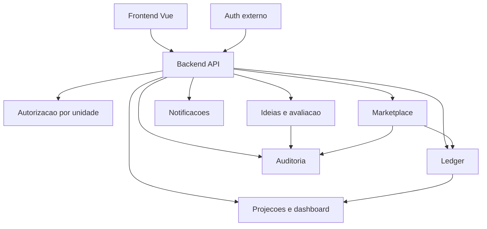

# DESIGN_SPEC

## 1. Overview

`Pense&Aja` é uma plataforma interna de inovação para unidades do Grupo Dass. O sistema conecta submissão de ideias, avaliação operacional, reconhecimento por pontos, resgate de recompensas e visibilidade gerencial.

O repositório é dividido em:

- `cliente/`: SPA/PWA em Vue 3
- `server/`: API Express + TypeScript
- `specs/`: documentação canônica do domínio e da arquitetura

## 2. Como navegar nas specs

Use este arquivo como mapa de alto nível. Para detalhes operacionais:

- backend: [specs/backend/README.md](/home/oendel/code/dass/pense_aja_app/specs/backend/README.md)
- frontend: [specs/frontend/README.md](/home/oendel/code/dass/pense_aja_app/specs/frontend/README.md)
- plano de evolução: [IMPLEMENTATION_PLAN.md](/home/oendel/code/dass/pense_aja_app/IMPLEMENTATION_PLAN.md)

## 3. Objetivos do produto

1. captar ideias de melhoria com contexto operacional suficiente
2. permitir avaliação controlada por unidade e papel
3. transformar avaliação válida em reconhecimento rastreável
4. permitir consumo desse reconhecimento em um marketplace controlado
5. oferecer indicadores e notificações baseados em dados consolidados

## 4. Princípios arquiteturais

- backend como fonte de verdade
- separação entre identidade, autorização e decisão de negócio
- rastreabilidade ponta a ponta
- regras configuráveis por unidade Dass
- compatibilidade progressiva durante a refatoração

## 5. Bounded contexts

### Ideias e avaliação

- cadastro, duplicidade, leitura, detalhe e workflow de avaliação

### Autorização

- papéis, permissões e escopo por unidade resolvidos pelo backend

### Ledger de pontuação

- lançamentos imutáveis de ganho, reversão, reserva, consumo e estorno

### Marketplace

- catálogo, solicitação, aprovação, fulfillment físico ou voucher e cancelamento

### Auditoria

- eventos de domínio, transições de status, diffs, ator e correlação

### Notificações e analytics

- comunicação ao usuário e projeções para dashboard

## 6. Frontend

O frontend continua como consumidor da API e camada de experiência. Ele não deve ser fonte de autorização nem de saldo.

### Responsabilidades

- capturar entrada do usuário
- exibir status e histórico já resolvidos pelo backend
- consumir contexto de sessão e permissões derivadas
- apresentar saldo disponível e andamento de resgates

### Restrições

- não inferir autorização final por substring de `funcao`
- não calcular saldo a partir de heurística local
- não tratar widget analítico como fonte de verdade operacional

## 7. Backend

O backend é o ponto central de consistência do produto.

### Responsabilidades

- validar unidade, identidade, payload e regras críticas
- resolver permissões com base no banco e no escopo da unidade
- registrar eventos de negócio e lançamentos de ledger
- materializar leituras de saldo e de histórico
- expor contratos estáveis ao frontend

### Organização lógica

- `routes`: superfície HTTP
- `controllers`: contrato de entrada/saída
- `services`: orquestração de domínio
- `middlewares`: autenticação, autorização e contexto de request
- `workers`: integrações assíncronas

## 8. Dependências e integrações

### Auth externo

- continua responsável por login, logout, refresh e cookie JWT
- a API do Pense&Aja usa o JWT para identidade base

### PostgreSQL

- datastore principal
- deve sustentar modelos de ideia, RBAC, ledger, auditoria, marketplace e projeções

### Redis

- blacklist de token
- apoia blacklist de token e revogação de sessão

### RabbitMQ

- eventos assíncronos e workflows operacionais

### Serviços externos

- notificação
- Gemini
- futuros provedores de voucher

## 9. Estado atual versus modelo-alvo

### Estado atual relevante

- RBAC hardcoded por substring de `funcao`
- pontos e resgates em tabelas agregadas
- ausência de ledger formal e trilha de auditoria rica
- fluxo de resgate em etapa única

### Modelo-alvo

- RBAC normalizado por unidade
- ledger append-only com saldo materializado
- histórico auditável por evento e diff
- marketplace com reserva, aprovação, fulfillment e estorno

## 10. Direção recomendada

1. alinhar documentação e contratos conceituais
2. normalizar autorização por unidade no backend
3. introduzir ledger e projeções de saldo
4. introduzir auditoria de eventos
5. refatorar o marketplace para workflow real
6. adaptar frontend para consumir o novo modelo sem heurística crítica
