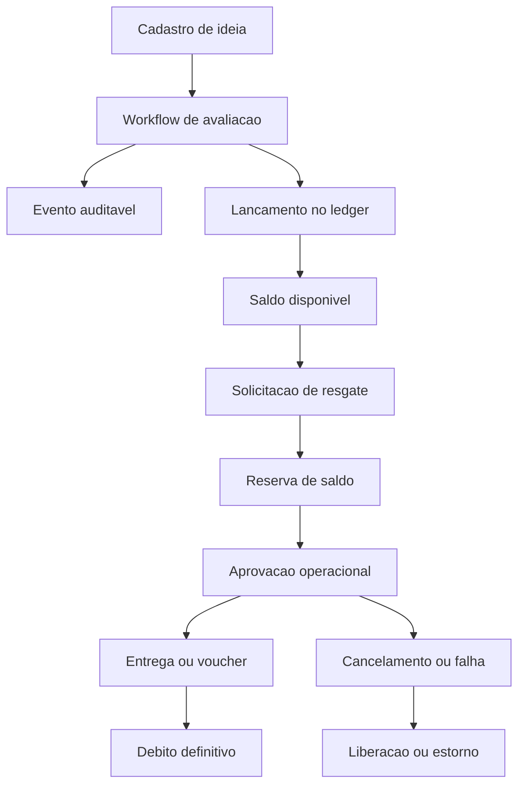

# Backend Business Rules

Este documento é a regra de negócio canônica do backend do Pense&Aja. Ele descreve:

- o fluxo operacional esperado do produto
- o estado atual relevante do código
- o modelo-alvo que deve orientar a refatoração

## Contexto de negócio

O Pense&Aja é uma plataforma de inovação aberta usada para transformar ideias em ação operacional. O backend sustenta esse processo garantindo:

- validade do contexto organizacional
- autorização por unidade e responsabilidade
- integridade da avaliação
- rastreabilidade da pontuação
- consistência dos resgates
- alimentação de dashboard e notificações

## Objetivos funcionais

1. permitir que colaboradores submetam ideias de melhoria
2. submeter essas ideias a avaliação governada
3. reconhecer ideias avaliadas com pontuação confiável
4. converter pontuação disponível em recompensas
5. manter visibilidade e histórico do ciclo inteiro

## Atores de domínio

### Colaborador

- cadastra ideia
- acompanha avaliação e histórico
- consulta saldo e classificações
- solicita resgates

### Avaliador

- atua em etapas de avaliação configuradas para sua unidade
- registra decisão, justificativa e atributos operacionais
- pode existir em papéis diferentes conforme a unidade

### Operador de marketplace

- aprova solicitações de resgate
- executa separação, entrega ou emissão de voucher
- cancela ou sinaliza falha operacional quando necessário

### Administrador/configurador

- mantém regras da unidade
- gerencia permissões, catálogo e configurações

## Princípios obrigatórios

### Backend como fonte de verdade

- nenhuma decisão crítica depende apenas da UI
- autorização, saldo, estado do resgate e histórico devem ser definidos no backend

### Escopo por unidade Dass

- toda regra sensível é resolvida dentro do contexto da unidade
- uma pessoa pode ter papéis diferentes em unidades diferentes

### Rastreabilidade

- toda mudança de negócio relevante deve gerar evento auditável
- todo ponto gerado ou consumido precisa de lastro identificável

### Imutabilidade do ledger

- pontos não devem ser apagados logicamente como forma principal de correção
- reversões e estornos devem ocorrer por contralançamento

## Unidades válidas

Hoje o backend valida explicitamente estas unidades:

- `SEST`
- `VDC`
- `ITB`
- `VDC-CONF`
- `STJ`

No modelo-alvo, a validação por unidade continua obrigatória, mas a governança de permissões, workflow e pontuação deve ser configurável dentro de cada unidade.

## Fluxo operacional-alvo

1. colaborador submete a ideia em uma unidade válida
2. backend valida campos, unidade e duplicidade
3. a ideia entra no workflow de avaliação definido para a unidade
4. cada decisão gera transição auditável
5. avaliações elegíveis geram lançamentos de ledger
6. saldo disponível pode ser reservado em solicitações de resgate
7. workflow de marketplace decide aprovação, fulfillment, débito definitivo ou estorno
8. dashboards, perfil e notificações refletem projeções consolidadas

## Cadastro de ideia

### Estado atual

- exige campos essenciais
- converte as 8 perdas lean em colunas binárias
- grava ganhos em JSON
- usa lock transacional e verificação de duplicidade por matrícula, projeto, data e unidade

### Regra de negócio

- o cadastro é a origem do ciclo operacional
- a unidade vinculada ao registro define seu escopo de negócio
- duplicidade não pode gerar competição artificial em ranking, avaliação ou pontos

### Modelo-alvo

- o evento de criação deve ser auditável
- autoria e contexto da unidade devem ser preservados para correlação futura com avaliação, pontos e resgate

## Avaliação

### Estado atual

- backend diferencia analista e gerente por substring em `funcao`
- `exclude` exclui
- `reprove` reprova sem classificação
- demais status atualizam `classificacao`, `a3_mae`, `em_espera` e `replicavel`

### Regra de negócio

- avaliação existe para transformar ideia cadastrada em decisão operacional
- reprovação não deve coexistir com classificação
- exclusão é ação sensível com alto impacto analítico e histórico

### Modelo-alvo

- o fluxo deve ser configurável por unidade
- permissões deixam de ser derivadas de `funcao` hardcoded
- cada transição deve registrar:
  - ator
  - papel efetivo
  - unidade
  - justificativa
  - timestamp
  - `before` e `after` dos campos relevantes

### Backbone mínimo de estados

O nome final dos estados pode variar por apresentação, mas a estrutura semântica mínima deve comportar:

- cadastrada
- em avaliação
- aprovada em etapa
- reprovada
- excluída
- concluída

## RBAC dinâmico por unidade

### Estado atual

- o backend aceita papéis por substring:
  - `analista`
  - `gerente`
  - `automacao`

### Modelo-alvo

- autorização passa a usar modelo normalizado de usuário, papel, permissão e escopo por unidade
- a mesma pessoa pode ser avaliadora em uma unidade e apenas colaboradora em outra
- permissões do marketplace são separadas das permissões de avaliação
- a administração dos vínculos RBAC é manual e restrita a `admin_master`

### Regra operacional

- JWT serve para identidade e sessão
- o backend resolve permissões efetivas no contexto da unidade
- a sessão pode carregar snapshot curto de permissões com TTL e versão
- snapshot não substitui a fonte de verdade
- snapshots devem ser invalidados quando um vínculo RBAC da unidade é criado, alterado ou removido

## Ledger de pontuação

### Estado atual

- aprovação com nota grava ou atualiza linha em `pense_aja.pense_aja_pontos`
- reprovação ou exclusão gerencial remove pontos associados

### Problema do modelo atual

- mistura histórico de origem com saldo efetivo
- dificulta auditoria e reconciliação
- corrige inconsistência por mutação ou remoção, não por contralançamento

### Modelo-alvo

O sistema deve adotar ledger append-only.

Tipos mínimos de lançamento:

- `earn`
- `reverse`
- `reserve`
- `commit`
- `release`
- `refund`

### Regras do ledger

- todo lançamento é imutável
- todo lançamento referencia entidade de origem
- toda reversão referencia o lançamento anterior afetado
- saldo disponível é projeção, não update arbitrário
- nenhum resgate pode consumir saldo não lastreado

### Relação entre avaliação e ledger

- avaliação elegível gera `earn`
- correção ou invalidação gera `reverse`
- solicitação de resgate gera `reserve`
- entrega ou emissão concluída gera `commit`
- rejeição ou cancelamento elegível gera `release` ou `refund`

## Saldo

O saldo funcional do usuário deve ser entendido em pelo menos três visões:

- saldo total gerado
- saldo reservado
- saldo disponível

Regra principal:

- `saldo_disponivel = ganhos_confirmados - consumos_confirmados - reservas_ativas`

O frontend deve consumir projeções consolidadas dessa conta, não recalcular por heurística local.

## Marketplace e resgates

### Estado atual

- produto precisa existir
- saldo atual é calculado por soma de pontos e soma de resgates
- o resgate é persistido diretamente em `pense_aja.pense_aja_premios`

### Problema do modelo atual

- não há separação entre solicitação, aprovação, fulfillment e entrega
- não há reserva de saldo na origem
- não há mecanismo claro de rollback operacional auditável

### Modelo-alvo

Fluxo-base:

1. usuário solicita resgate
2. backend valida elegibilidade e cria `reserve`
3. resgate entra em estado operacional
4. operador aprova ou rejeita
5. item físico segue separação e entrega, ou voucher segue emissão
6. conclusão gera `commit`
7. falha ou cancelamento elegível gera `release` ou `refund`

### Regras mínimas

- catálogo é segregado por unidade
- permissões operacionais do marketplace são próprias
- item físico e voucher compartilham backbone de estados
- passos específicos de fulfillment podem divergir

## Auditoria de domínio

### Eventos mínimos

- cadastro de ideia
- transição de avaliação
- geração ou reversão de pontos
- solicitação de resgate
- aprovação, rejeição, separação, entrega, emissão de voucher, cancelamento e estorno
- alteração de configuração sensível da unidade

### Conteúdo mínimo do evento

- tipo de evento
- entidade e id correlacionado
- ator
- unidade
- timestamp
- motivo ou justificativa
- `before`
- `after`
- correlation id

### Regra

- auditoria não substitui tabela operacional
- auditoria registra história de decisão e mutação relevante

## Usuário e notificações

### Estado atual

- email corporativo `@grupodass.com.br`
- opt-in por `authorized_notifications_apps`
- fallback legado `["null"]` quando lista vem vazia

### Regra de negócio

- receber notificação depende de política de autorização do app
- existir email não significa poder ser notificado

### Evolução

- notificações de avaliação, pontuação e resgate devem nascer de eventos de domínio
- falha de notificação não deve invalidar a transação principal

## Dashboard e analytics

### Papel

- o dashboard é projeção de leitura do domínio
- ele não cria regra nova, apenas expõe o estado consolidado

### Estado atual relevante

- parte dos indicadores usa inferência e dados sintéticos
- pontuação ainda deriva de tabela legada, não de ledger

### Modelo-alvo

- dashboards devem consumir leituras derivadas do ledger e do marketplace
- dados sintéticos devem ser claramente segregados de dados canônicos

## IA

### Regra

- IA é assistiva
- não substitui autorização, avaliação formal, ledger ou auditoria

## Riscos atuais observáveis

- vocabulário de status ainda não está totalmente normalizado
- algumas rotas seguem sem autenticação no código atual
- permissões críticas continuam hardcoded
- pontuação e resgate ainda não têm trilha contábil formal

## Resumo operacional

O núcleo do produto deve permanecer:

1. ideia válida nasce dentro de uma unidade válida
2. ela evolui por ações autorizadas no backend
3. cada decisão relevante deixa trilha auditável
4. cada ponto gerado ou consumido possui lastro em ledger
5. cada resgate respeita reserva, workflow operacional e reconciliação
6. frontend, dashboard e notificações consomem estados consolidados do backend
