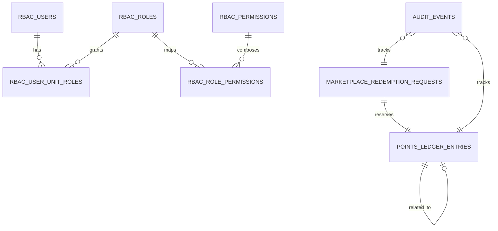

# Backend Database Models

Este documento descreve a modelagem de dados relevante para a evolução do Pense&Aja. Ele combina:

- estruturas atuais importantes para entendimento do código
- modelo-alvo recomendado para RBAC, ledger, auditoria e marketplace

## Estruturas atuais relevantes

### Ideias

Tabela atual principal:

- `pense_aja.pense_aja_dass`

Responsabilidade:

- armazenar o cadastro da ideia
- manter campos de status, avaliadores, classificação e atributos operacionais

### Pontos

Tabela atual:

- `pense_aja.pense_aja_pontos`

Responsabilidade atual:

- guardar pontos gerados por ideia avaliada

Limitação:

- não é um ledger formal

### Resgates

Tabela atual:

- `pense_aja.pense_aja_premios`

Responsabilidade atual:

- registrar solicitação/entrega de prêmio de forma agregada

Limitação:

- não representa workflow completo

### Catálogo

Tabela atual:

- `pense_aja.pense_aja_loja`

### Usuários e identidade

Tabelas atuais:

- `autenticacao.usuarios`
- `autenticacao.emails`
- `core.unidades_dass`
- `colaborador.lista_funcionario[_UNIDADE]`

## Modelo-alvo recomendado

## 1. Autorização por unidade

### `rbac_users`

- referência lógica ao ator autenticado
- chave funcional por matrícula
- atributos básicos de identidade

### `rbac_roles`

- papéis nomeados do domínio
- exemplos: `idea_submitter`, `idea_reviewer`, `marketplace_operator`, `marketplace_admin`, `unit_admin`

### `rbac_permissions`

- permissões atômicas
- exemplos:
  - `idea.evaluate`
  - `idea.exclude`
  - `marketplace.request.approve`
  - `marketplace.fulfillment.execute`
  - `catalog.manage`

### `rbac_role_permissions`

- mapeia papel para permissões

### `rbac_user_unit_roles`

- atribui papel ao usuário dentro de uma unidade
- permite vigência e ativação

### `rbac_session_snapshots`

- snapshot curto de permissões por sessão
- inclui versão, escopo de unidade e expiração

## 2. Workflow e configuração por unidade

### `unit_configs`

- metadados gerais da unidade
- flags operacionais

### `unit_scoring_rules`

- regras de pontuação por unidade e vigência
- suporta matriz A/B/C ou variações futuras

### `unit_workflow_steps`

- etapas do workflow de avaliação
- ordem, obrigatoriedade e permissões necessárias

### `unit_marketplace_policies`

- regras de reserva, cancelamento, aprovação e fulfillment

## 3. Ledger de pontuação

### `points_ledger_entries`

Entidade central do saldo auditável.

Campos conceituais mínimos:

- `id`
- `user_registration`
- `dass_office`
- `entry_type`
- `amount`
- `status`
- `source_type`
- `source_id`
- `related_entry_id`
- `correlation_id`
- `reason`
- `created_by`
- `created_at`

Tipos esperados:

- `earn`
- `reverse`
- `reserve`
- `commit`
- `release`
- `refund`

### `points_balance_projection`

- visão materializada por usuário e unidade
- expõe pelo menos:
  - total gerado
  - total consumido
  - total reservado
  - saldo disponível

## 4. Auditoria

### `audit_events`

Tabela canônica de trilha operacional.

Campos conceituais mínimos:

- `id`
- `event_type`
- `aggregate_type`
- `aggregate_id`
- `dass_office`
- `actor_registration`
- `actor_role`
- `reason`
- `before_state`
- `after_state`
- `metadata`
- `correlation_id`
- `created_at`

## 5. Marketplace

### `marketplace_catalog_items`

- substitui ou evolui a tabela atual de loja
- suporta tipo do item: físico ou voucher
- suporta disponibilidade e política por unidade

### `marketplace_redemption_requests`

- representa a solicitação do usuário
- separa origem do pedido do resultado final

Campos conceituais mínimos:

- `id`
- `user_registration`
- `dass_office`
- `catalog_item_id`
- `request_status`
- `reserved_ledger_entry_id`
- `approval_actor`
- `fulfillment_type`
- `created_at`
- `updated_at`

### `marketplace_fulfillment_steps`

- rastreia separação, entrega ou emissão
- útil para itens físicos e vouchers

### `marketplace_voucher_deliveries`

- integra status externo de voucher quando aplicável

## Relações recomendadas

## Regras de modelagem

- ledger deve ser append-only
- auditoria deve ser separada da tabela operacional
- permissões devem ser modeladas em estrutura relacional, não por substring de cargo
- projeções de leitura podem ser recalculáveis a partir da fonte de verdade
- unidade deve estar presente em todas as entidades críticas de domínio
